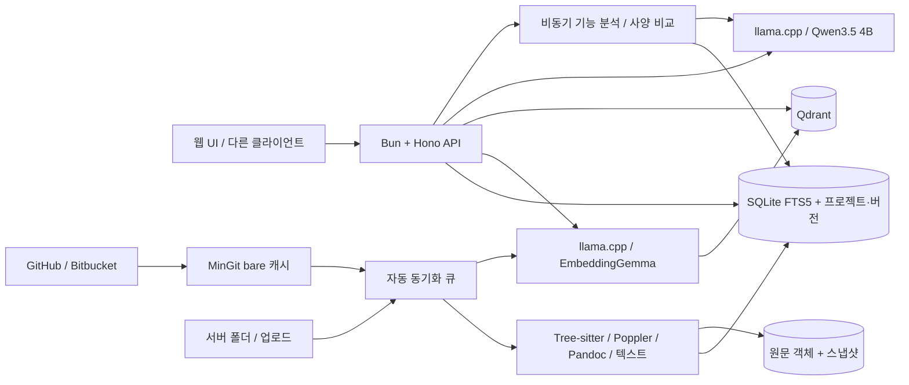

# Nexa

외부 LLM(OpenAI, Claude, GitHub Copilot) 연결 설정은 [docs/external-llm.md](docs/external-llm.md)를 참고하세요. API 키는 서버 환경 변수에 넣고, RAG의 임베딩·Qdrant 검색은 기존 로컬 경로를 유지합니다.

소스 코드·사양서·개발 문서를 프로젝트와 모듈별로 검색하고, SW 버전별 근거와 사양 차이를 확인하는 로컬 RAG 애플리케이션입니다. Windows에서 실행하며 설치 파일, 모델 가중치, 실행 의존성을 GitHub의 공개 파일에서 확보합니다. 등록한 GitHub/Bitbucket 저장소와 문서 폴더는 자동 동기화하고, 확정한 버전의 자료는 별도로 보존합니다.

## 실행

프로젝트 폴더의 명령 프롬프트(CMD) 또는 PowerShell에서 실행합니다. 현재 개발 PC에는 검증된 런타임과 모델을 설치해 두었습니다.

CMD:

```cmd
scripts\setup.cmd
scripts\start.cmd
```

PowerShell:

```powershell
powershell -NoProfile -ExecutionPolicy Bypass -File .\scripts\setup.ps1
powershell -NoProfile -ExecutionPolicy Bypass -File .\scripts\start.ps1
```

CMD 진입점은 Windows 기본 PowerShell 5.1로 기존 설치·실행 스크립트를 호출합니다. PowerShell 창을 열거나 시스템 실행 정책을 바꿀 필요는 없으며, `.ps1`과 같은 옵션을 사용할 수 있습니다.

브라우저에서 **http://127.0.0.1:8787** 을 엽니다.

1. **Connection settings**에서 `data/admin-key.txt`의 관리자 키를 입력합니다. 키는 브라우저 세션 동안 보관됩니다.
2. 프로젝트를 만들고 Git 저장소, 서버 문서 폴더 또는 업로드를 연결합니다. 자료 역할은 코드·사양·참고로 구분하고 모듈별 경로 규칙을 설정할 수 있습니다. 기존 자료는 `Default project`로 이관됩니다.
3. 동기화가 끝나면 프로젝트·모듈·버전을 선택해 질문하거나 검색합니다. 근거에는 원문 파일과 줄, PDF 페이지 또는 DOCX 제목·문단·표 위치가 표시됩니다.
4. Git과 폴더는 기본 5분마다 변경을 확인합니다. 폴더 저장 이벤트는 약 2초 동안 모아 반영하며, 필요한 경우 즉시 재동기화할 수 있습니다.
5. 현재 자료를 SW 버전으로 확정하면 당시 Git 커밋과 문서 원문을 보존합니다. 확정 버전을 대상으로 기능 근거 탐색과 A/B 사양 비교를 실행합니다.

예제 폴더는 `examples/atlas-a`, `examples/atlas-b`입니다. 각각 보드 `ATLAS`, 리비전 `A`와 `B`로 등록하면 `UART 콘솔 통신 속도는 얼마야?`를 비교할 수 있습니다. **예제는 가상의 개발용 자료**입니다.

중지할 때는 사용 중인 셸에 맞는 명령을 실행합니다.

```cmd
scripts\stop.cmd
```

```powershell
powershell -NoProfile -ExecutionPolicy Bypass -File .\scripts\stop.ps1
```

새 PC 설치, GitHub 접속 도메인, 오프라인 캐시, 팀 접속 설정은 [Windows 설치 안내](docs/setup-windows.md)를 참고하세요. API 계약과 다른 클라이언트 연동 예시는 [API 문서](docs/api.md)에 있습니다.

## 구현 범위

- 프로젝트·모듈·자료 역할 관리, 경로 규칙에 따른 모듈 연결
- GitHub/Bitbucket cloud 원격 연결, 브랜치 자동 갱신, 태그 감지와 버전 후보
- 폴더 변경 감시와 정기 전체 대조, 다중 업로드, 동기화 일시정지·재시도·실패 진단
- 원문·추출 결과 공유 저장, 불변 스냅샷과 SW 버전 보존, 보존 원문의 파서 재처리
- C/C++ AST·함수 심볼, 일반 텍스트 청크, UTF-8/UTF-16, 텍스트 PDF 페이지 추출
- Pandoc DOCX 파싱: 제목 경로·문단·목록·표 위치, 변경추적의 삽입 반영·삭제 제외
- SQLite FTS5 식별자·키워드 검색 + Qdrant 벡터 검색의 RRF 순위 결합
- 프로젝트·버전·모듈·자료 역할·보드·리비전 범위를 검색과 인용에 적용
- 영어 UI와 답변, 원문 인용, 근거 부족 시 답변 보류
- 비동기 버전별 기능 근거 분석: 사양 명시·코드 구현·빌드 포함을 구분
- 두 버전의 전체 사양 문서 대응과 원문 diff, 숫자·단위·표 변화 및 양쪽 근거
- JSON 응답 및 인용 ID 검증, 삭제되거나 바뀐 자료의 오래된 벡터 차단
- 모델 장애 시 키워드 검색으로 전환, 모델 복구 후 재색인으로 누락 벡터 보충
- 관리자 자료 관리 키, 선택적 팀 공용 API 키, 허용된 출처의 웹 클라이언트 지원
- 별도 빌드 단계가 없는 웹 UI, 독립적인 `/api/v1` HTTP API

색인 작업은 직렬 큐로 처리합니다. 생성 요청은 한 번에 1개, 실행 중 요청을 포함해 최대 12개까지 받습니다. 대기열 초과 요청에는 HTTP 429를 반환합니다. 파일은 하나당 20 MiB, 업로드는 요청당 100 MiB·100개, 폴더 탐색은 100,000개까지입니다. 제한이나 읽기 실패는 작업 진단에 표시합니다.

Git은 `github.com`과 `bitbucket.org`의 HTTPS/SSH 저장소를 지원합니다. 한 번의 Git 수집은 총 256 MiB, 태그 목록은 1,000개까지이며 초과분은 진단으로 표시합니다. 사용자 작업 트리를 checkout하거나 pull하지 않고 Nexa의 bare 캐시에서 커밋 객체를 읽습니다. 커밋 전 코드를 반영하려면 해당 작업 폴더를 별도 폴더 소스로 연결하세요. 메모리에만 있고 파일에 저장되지 않은 편집 내용은 수집할 수 없습니다.

최초 연결 시 이미 존재하는 태그는 과거 버전 목록으로 취급합니다. 그 태그로 버전을 만들 때는 당시 사양서 스냅샷을 직접 선택해야 합니다. 이후 새로 감지한 태그의 후보에는 감지 당시 연결된 문서 스냅샷을 제안하며 사용자가 확인해 확정합니다. 사양서 내용과 태그의 실제 대응 관계를 자동으로 보증하지 않습니다.

## 구성



| 용도 | 선택 |
| --- | --- |
| 생성 | Qwen3.5 4B Q4_K_M, llama.cpp CUDA |
| 임베딩 | EmbeddingGemma 300M Q8_0, 768차원 |
| 검색 | Qdrant 1.19.1 + Bun 내장 SQLite FTS5 |
| API | Bun 1.4.2 + Hono 4.13.8 GitHub 소스 |
| 파싱 | Tree-sitter 0.27.0 C/C++ WASM + Poppler 26.09.0 + Pandoc 3.11 |
| Git 수집 | MinGit 2.55.0.5, 작업 트리 없는 bare 캐시 |
| UI | HTML/CSS/JavaScript, 외부 CDN 및 npm 의존성 없음 |

RAGFlow의 기본 Docker·다중 서비스 배포 경로와 Python 기반 프레임워크의 외부 패키지 의존성이 이번 GitHub 전용·Windows 네이티브 제약에 맞지 않아, 검증된 검색·추론·파싱 구성 요소를 연결했습니다. 앱 실행 시 패키지나 모델을 자동으로 내려받지 않습니다. 버전과 SHA256은 [artifacts.json](config/artifacts.json)에 고정되어 있습니다.

SQLite는 단일 API 프로세스만 소유합니다. 원문은 내용 해시로 공유 저장하고 추출 결과와 임베딩 입력도 재사용합니다. 최신 작업 스냅샷은 소스별 최근 30개를 유지하며, 확정 버전이나 버전 후보가 참조하는 스냅샷은 별도로 보존합니다. 확정한 자료는 원본 파일이 바뀌거나 연결을 삭제해도 해당 버전에서 조회할 수 있습니다.

모듈 규칙을 수정하면 현재 자료를 재분류합니다. 파일 이름과 내용이 함께 바뀐 문서는 연결 설정의 `documentLinks`로 이전 경로에 대응시킬 수 있습니다. 파서가 개선되면 버전 재색인 API로 보존 원문에서 새 검색 색인을 만들며, 확정 당시의 원문·스냅샷 연결은 유지합니다.

Qdrant 검색 결과는 SQLite의 프로젝트·스냅샷·모듈 범위와 다시 대조합니다. 접근불가 연결은 기존 보존 자료를 유지하고 최신 검색에서 제외해 진단을 표시합니다. `data` 전체를 서비스 중지 후 백업하면 SQLite, 원문 객체, Git 캐시, Qdrant, 업로드, 키를 함께 보관할 수 있습니다. 외부 폴더와 원격 Git 저장소 자체의 백업은 별도로 관리하세요.

처음 구버전 데이터를 열 때 기존 문서가 있으면 `data/backups/before-knowledge-*.sqlite`에 SQLite 사본을 만듭니다. 이관 자료의 최초 스냅샷은 기존 추출 텍스트이며 과거 원본 DOCX/PDF를 복원한 것은 아닙니다. 이 추출본은 원문 보존 버전으로 확정할 수 없으며 원문 보존은 재동기화한 시점부터 적용됩니다.

## 검증

CMD:

```cmd
.runtime\bun\bun.exe --no-install test ./tests
REM 실행 스크립트의 프로세스 소유권과 설정 불일치 검사 (서비스 변경 없음)
scripts\test-process-ownership.cmd
scripts\test-session-settings.cmd
REM 실제 모델 서비스가 실행 중일 때: 예제 자료를 등록하고 6개 질의를 확인
.runtime\bun\bun.exe --no-install tests/live-smoke.ts
REM 선택 실행: 임시 자료로 50개 버전 × 10,000개 파일 항목의 저장·키워드 검색 확인
.runtime\bun\bun.exe --no-install tests/scale-smoke.ts --run
```

PowerShell:

```powershell
& .\.runtime\bun\bun.exe --no-install test ./tests
# 실행 스크립트의 프로세스 소유권과 설정 불일치 검사 (서비스 변경 없음)
& .\scripts\test-process-ownership.ps1
& .\scripts\test-session-settings.ps1
# 실제 모델 서비스가 실행 중일 때: 예제 자료를 등록하고 6개 질의를 확인
& .\.runtime\bun\bun.exe --no-install tests/live-smoke.ts
# 선택 실행: 임시 자료로 50개 버전 × 10,000개 파일 항목의 저장·키워드 검색 확인
& .\.runtime\bun\bun.exe --no-install tests/scale-smoke.ts --run
```

단위·통합 테스트는 파싱 위치, Git 커밋 읽기와 작업 트리 보존, 스냅샷·버전·필터, 변경·삭제, 관리자 인증, 요청 제한, 인용 검증, 분석·생성 대기열을 확인합니다. DOCX 테스트는 설치된 Pandoc, Git 테스트는 임시 저장소와 설치된 MinGit를 사용합니다. 실제 모델 smoke 결과는 `data/live-smoke-results.json`에 저장됩니다. `vendor`의 타 프로젝트 테스트가 포함되지 않도록 `./tests` 경로를 명시하세요.

`scale-smoke.ts`는 OS 임시 폴더에 작은 생성 텍스트와 메타데이터를 만들고, 버전마다 95% 파일 내용 공유와 5개 동시 키워드 요청을 확인합니다. 결과와 임시 자료는 표시된 폴더에 남습니다. 기본 data·모델 서비스를 사용하지 않으며, 원본 수집·파싱·임베딩·전체 서비스 처리량을 검증하는 성능 시험은 아닙니다.

기존 단일 버전 RAG는 개발 PC의 RTX 4060 Ti 8GB에서 예제 질의 6개를 실제 API와 모델로 검증했습니다. 신규 기능의 자동 테스트와 실제 모델·운영 확인은 구분해서 기록합니다. 최신 결과와 한계는 [검증 기록](docs/validation.md)을 참고하세요.

## 현재 한계

- 텍스트 PDF와 DOCX를 지원합니다. 스캔 PDF OCR, 도면·회로도 이미지 해석, 구형 `.doc`, Excel·PowerPoint 파싱은 지원하지 않습니다. DOCX에 Word 레이아웃 페이지 번호를 만들어 붙이지 않습니다.
- C/C++ 이외 언어는 줄 기준으로 청크를 나눕니다. CP949 등 레거시 인코딩 파일은 UTF-8로 변환해야 합니다.
- GitHub Enterprise·사내 Bitbucket Server 등 별도 호스트, Git LFS 원문 자동 다운로드, submodule 자동 수집은 지원하지 않습니다. LFS 원문이나 submodule은 실제 파일이 있는 폴더 또는 별도 저장소로 연결하세요.
- 자동 동기화의 2초·5분은 감지 주기입니다. 파일 수, 직렬 작업 대기열, 모델 처리에 따라 검색 반영은 더 늦을 수 있습니다.
- 기능 검색 결과가 없으면 `미확인`입니다. 최초 도입 버전이나 실제 배포 포함 여부를 자료 없이 추정하지 않습니다. 사양 원문 diff가 실제 동작 변경을 증명하지는 않습니다.
- 보드·리비전 선택은 명시적 필터입니다. 자연어에서 자동으로 소스를 분리하거나 하드웨어 호환성을 판정하지 않습니다.
- 모든 팀원은 같은 자료를 검색합니다. 개인 계정, 문서별 ACL, SSO는 없습니다. 원본 파일 경로도 팀에 표시됩니다.
- 답변 검증은 형식과 출처 존재 여부를 검사합니다. 사실 정확성을 보장하지 않으므로 실제 개발 판단에는 표시된 근거를 확인하세요.
- 비공개 GitHub/Bitbucket 원격의 실제 인증·회사망 접속, RTX A4000 16GB, 수만 파일·다중 사용자 부하, 깨끗한 Windows 설치는 아직 검증하지 않았습니다.

모델은 제3자 GitHub 배포본입니다. 검증된 해시는 배포 파일의 무결성을 확인하며 원저자의 변환물을 독립적으로 인증하지는 않습니다. EmbeddingGemma의 Gemma 이용 조건 등은 [서드파티 안내](THIRD_PARTY_NOTICES.md)에 기록했습니다.
